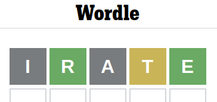

# Introduction

A wordle solver in C for the popular word-guessing game wordle.



Our heuristic picks the word containing the letters occurring most commonly in the remaining possible vocabulary.

Essentially, at each step in our solver we select the word that maximizes:
```
  score(word | vocabulary) = sum(score(letter | vocabulary), for unique letters in word)
```

where:

```
  score(letter | vocabulary) = # words in vocabulary that contain letter
```

## Interacting With the Solver

Interaction occurs in `solver.c`, it can be called in one of two different ways:

```
$ ./solver motif
```

This runs the guessing algorithm with a specified secret word, automatically, in this case it runs "motif".

Or alternatively, to play a wordle puzzle with an unknown word (ie, live on a website):

```
$ ./solver
```

This will suggest guesses for the user, and prompt them to input the result as a string of 5 characters (some sequence of 'g' 'y' and 'x'), making more suggestions as it narrows the search space.